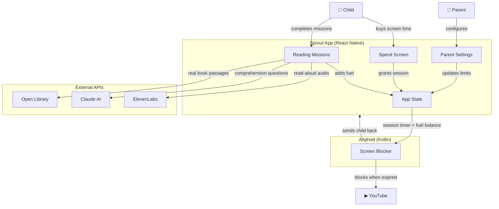

```mermaid
flowchart TD
    Child["👦 Child"]
    Parent["👨 Parent"]

    subgraph App["Sprout App (React Native)"]
        Earn["Reading Missions"]
        Spend["Spend Screen"]
        Settings["Parent Settings"]
        Store["App State"]
    end

    subgraph APIs["External APIs"]
        OpenLib["Open Library"]
        Claude["Claude AI"]
        ElevenLabs["ElevenLabs"]
    end

    subgraph Android["Android (Kotlin)"]
        Blocker["Screen Blocker"]
    end

    YouTube["▶ YouTube"]

    Child -->|completes missions| Earn
    Child -->|buys screen time| Spend
    Parent -->|configures| Settings

    Earn -->|real book passages| OpenLib
    Earn -->|comprehension questions| Claude
    Earn -->|read-aloud audio| ElevenLabs
    Earn -->|adds fuel| Store

    Spend -->|grants session| Store
    Settings -->|updates limits| Store

    Store -->|session timer + fuel balance| Blocker

    Blocker -->|blocks when expired| YouTube
    Blocker -->|sends child back| App
```
